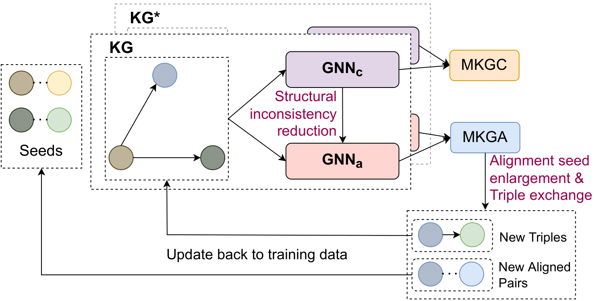

# [Joint Multilingual Knowledge Graph Completion and Alignment](https://www.pytorch.org)
[](https://www.pytorch.org)
[](https://www.python.org/)
[](https://www.pytorch.org/)
[](https://2022.emnlp.org/)

> Knowledge graph (KG) alignment and completion are usually treated as two independent tasks. While recent work has leveraged entity and relation alignments from multiple KGs, such as alignments between multilingual KGs with common entities and relations, a deeper understanding of the ways in which multilingual KG completion (MKGC) can aid the creation of multilingual KG alignments (MKGA) is still limited. Motivated by the observation that structural inconsistencies -- the main challenge for MKGA models -- can be mitigated through KG completion methods, we propose a novel model for jointly completing and aligning knowledge graphs. The proposed model combines two components that jointly accomplish KG completion and alignment. These two components employ relation-aware graph neural networks that we propose to encode multi-hop neighborhood structures into entity and relation representations.  


##### Table of Content

1. [Introduction](#overview)
2. [Getting Started](#getting-started)
    - [Datasets](#datasets)
    - [Installation](#installation)
3. [Experiments](#experiments)
    - [Training & Testing](#training-and-testing)
4. [Citations](#citations)


# Overview

We use [Python](https://www.python.org/) and [Pytorch](https://www.pytorch.org/) to implement a joint KG maching and completion algorithm named **JMAC**. The overal framework is illustrated as follow:

<p align="center">

</p>

Details of the model architecture and experimental results can be found in [our following paper]():

## Getting Started

### Datasets
We use [DBP-5L](https://github.com/vinhsuhi/JMAC/tree/master/datasetdbp5l). The dataset is already included in this repository. We noticed in the original dataset [PDB-5L](https://www.cse.iitb.ac.in/~soumen/doc/AlignKGC/DBP-5L.zip) there are a small amout of duplicate alignment seeds. We already elimilated these errors and saved to this repository. The structure of the dataset is listed as follows:

```
datasetdbp5l/:
├── entities/
│   ├── el.tsv: entity names for language 'el'
├── kg/
│   ├── el-train.tsv: the train dataset for the completion task
│   ├── el-val.tsv: the train dataset for the completion task
│   ├── el-test.tsv: the train dataset for the completion task
├── seed_train_pairs/
│   ├── el-en.tsv: alignment training seeds
├── seed_train_pairs/
│   ├── el-en.tsv: alignment test seeds
├── relation.txt: set of relations
```

Before running the code, please download the pretrained word embedder [wiki-news-300d-1M.vec.zip](https://dl.fbaipublicfiles.com/fasttext/vectors-english/wiki-news-300d-1M.vec.zip) and extract it to 'JMAC/.'

We also develop a version for running KG alignment on the [DBPv1 (OpenEAv1) dataset](https://www.dropbox.com/s/nzjxbam47f9yk3d/OpenEA_dataset_v1.1.zip?dl=0). Please try [JMAC_DBPv1](https://github.com/vinhsuhi/JMAC/tree/master/JMAC_DBPv1) to reproduce our alignment results on the DPBv1 dataset.


### Installation:
```
# clone the repo
git clone https://github.com/vinhsuhi/JMAC.git
cd JMAC

# install dependencies
pip install -r requirements.txt
```

## Experiments
### Training and Testing

To reproduce our experiments, please use the following script:

```
python train.py --data_path datasetdbp5l/ --target_language ja 
```
## Citations


```
@article{tong2022jmac,
  title={Joint Multilingual Knowledge Graph Completion and Alignment},
  author={Tong, Vinh and Nguyen, Dat Quoc and Trung, Huynh Thanh and Nguyen, Thanh Tam and Nguyen, Quoc Viet Hung and Mathias, Niepert},
  journal={Findings of the Association for Computational Linguistics: Findings of EMNLP 2022},
  year={2022}
}
```

**Please CITE** our paper whenever our model implementation is used to help produce published results or incorporated into other software.


